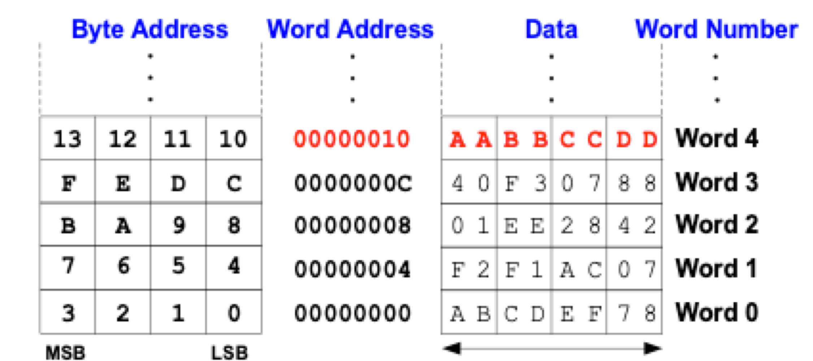
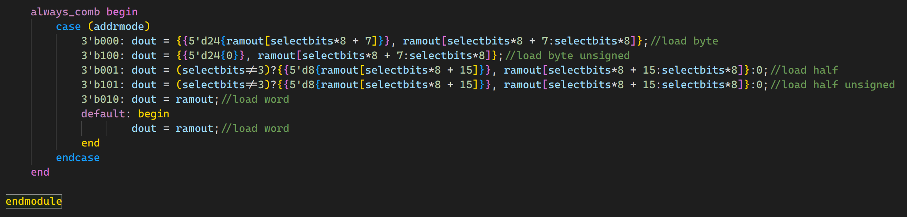
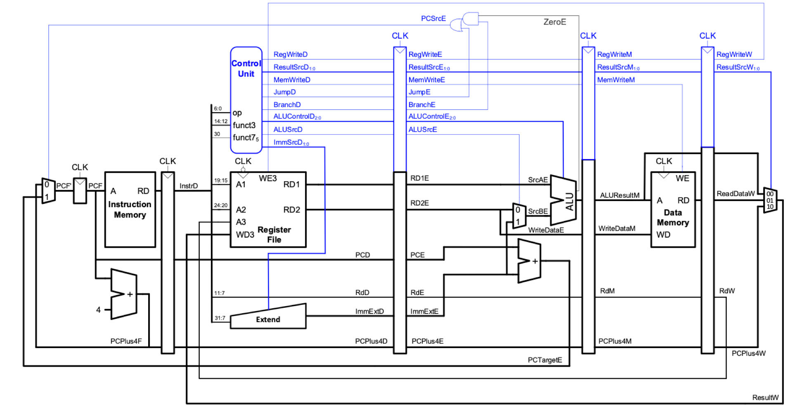

# Yi Zhang's Personal Statement

**CID:** 07951642408

**Intro:** In the project of **[EIE2-IAC-Autumn-Term-Team-30](https://github.com/Yi-Zhang-IC/EIE2-IAC-Autumn-Term-Team-30)**, I was responsible for designing Data Memory for single-cycled-CPU, Data Memory and Top for pipelined-CPU, and Testing program of "Whole" and "Alu".

<br/>

## 1. Data Memory in single-cycled-CPU

### 1.1 Design Decisions 

The Data Memory is mainly used to do load and store instructions. The input will be write_data from register, address from alu, addrmode, selectbytes, write_enable from control unit and clk. The Data is byte addressed in the memory, so the word address is always an multiple of 4. **The last 2 bit of the word address is therefore always 0.** **We can make use of the last 2 bits from the address input to decide which byte or half word we want to select.**

> 

For byte manipulation, we can select any byte in a word from 1 to 4. 

For half word manipulation, we can select an half word from any of the first 3 bytes.

For word manipulation, we don't use input from selectbytes.

|    Instruction     | addrmode | selectbytes | write_enable |
| :----------------: | :------: | :---------: | :----------: |
|     load byte      |   000    | 00/01/10/11 |      0       |
|     load half      |   001    |  00/01/10   |      0       |
|     load word      |   010    |     N/A     |      0       |
| load byte unsigned |   100    | 00/01/10/11 |      0       |
| load half unsigned |   101    |  00/01/10   |      0       |
|     store byte     |   000    | 00/01/10/11 |      1       |
|     store half     |   001    |  00/01/10   |      1       |
|     store word     |   010    |     N/A     |      1       |

Before the project was released, our group was initially attempting to build the data memory including bit manipulation in one file (see [base cpu](https://github.com/EIE2-IAC-Labs/iac-riscv-cw-30/commit/21955df0744b9a0c4724f46077c0f6ace53c8808)). However, it is actually not possible to personalise a ram module with bit manipulation functions in real life. As a result, Data Memory is designed to include 3 parts: **ram.sv**, **loadmem.sv**, and **storemem.sv**. **The ram doesn't contain any bit manipulation inside it now.** The ram is addressed according to the memory map of older version in "memory" branch. In the final submission branch, the ram is correctly addressed with larger capacity.

In order to show clearly, the top design graph has input with blue colour and output with red colour. For store byte and tore half instructions, we don't want to ruin other information in the word. Therefore, we **feed back** output from ram and replace a specific part of the word with data_in. Part of the code is shown below as an example. The output after bit manipulation is stored into the ram finally. 

```System Verilog
  always_comb begin
    case (addrmode)
      3'b000:  // store byte
      case (selectbytes)
        2'b00: ramdin = {ramout[31:8], write_data[7:0]};  // select first byte
        2'b01: ramdin = {ramout[31:16], write_data[7:0], ramout[7:0]};  // select second byte
        2'b10: ramdin = {ramout[31:24], write_data[7:0], ramout[15:0]};  // select third byte
        2'b11: ramdin = {write_data[7:0], ramout[23:0]};  // select fourth byte
      endcase
```

Creating a top module for data memory will save some work for my partner Omar in wiring the top, and make my work easier in pipelining. **The whole working process is shown as consecutive commits in branch "memory" from [commit](https://github.com/EIE2-IAC-Labs/iac-riscv-cw-30/commit/24c8bdd3c081f7206fa4e6b9d62e4bd26fe9f527) to [commit](https://github.com/EIE2-IAC-Labs/iac-riscv-cw-30/commit/9060ac24b41a67d8eca90d4405951177762604a7).**

<br/>

### 1.2 Problems Encountered

a) I attempted to **use functions** in System Verilog to do bit manipulations for load and store. I thought this might be one of the smartest way to make code shorter and cleaner in the beginning. 



However, the method **doesn't work**. The expression is expected to be **constant** in System Verilog. **Error message shown as below**.


As a result, I have to use case inside case to do bit manipulation (see **"loadmem.sv"** [commit](https://github.com/EIE2-IAC-Labs/iac-riscv-cw-30/commit/e38c256fddaf8844b7661ac7581769e3145bd7b8) and **"storemem.sv"** in [commit](https://github.com/EIE2-IAC-Labs/iac-riscv-cw-30/commit/5220d066a6100a3f4b99799e2f8e87497375d4cc)). 


b) Syntax errors are always annoying. By looking at **"verilator --help"**, i created **"check.sh"** to help me find syntax error in [commit](https://github.com/EIE2-IAC-Labs/iac-riscv-cw-30/commit/0984726b75c61bdf40da9bd350fcc64ec28b5891). 

```
file=loadmem #enter any module you want to check syntax error 

verilator -Wall --lint-only ${file}.sv
```

**"-Wall" means enable all style warnings and "--lint-only" means lint but do not make output**.


c) **USB port varies** when I plug and unplug Vbuddy to Linux. In order to save time in finding USB port, I add one line in "doit.sh" to getting the USB port automatically. **This line is only useful if you are a Linux user.**

```
ls /dev/ttyUSB* > vbuddy.cfg
```

<br/>

### 1.3 Testing Data Memory

Done by my Jie. See his [personal statement](xxx).

<br/>

## 2. Creating Top Level Module for Pipelined-CPU

This part of work was done in the **"pipelinetest"** branch. The working process can be verified through consecutive commits from [commit](https://github.com/EIE2-IAC-Labs/iac-riscv-cw-30/commit/e20b6c5b2c9faddea8b3270d3eefa6fd69e07c63) to [commit](https://github.com/EIE2-IAC-Labs/iac-riscv-cw-30/commit/e20b6c5b2c9faddea8b3270d3eefa6fd69e07c63). The Pipelined-CPU is divided into five sections : **"Fetch", "Decode", "Execute", "Memory", "Writeback"**. After effective communication with my team members, the wiring is straightforward. **In the top module, there are 2 main tasks need to be done.**

> 

<br/>

### **2.1 Flushing After Jump or Branch instructions**

**This problem doesn't exist for single-cycled-CPU.** However, since the CPU is now pipelined, the following two instructions are fetched before branch occurs. **We can use the value of pcsrcE as a trigger of flushing.** We know if pcsrcE is one, we will Fetch instruction from target address in the next cycle. Meanwhile, the following two instructions will enter "Decode" section and "Execute" section separately. Therefore, if pcsreE is one, the CPU will flush the two registers containing instructions that we don't want, by simply **resetting the output of the 2 registers to be zeros**. A short example shown as below.

```
  always_ff @(posedge clk) begin
    if (!pcsrcE) begin
      instrD <= instrF;
      pcD <= pcF;
      pcplusfourD <= pcplusfourF;
    end
    else begin
      instrD <= 0;
      pcD <= 0;
      pcplusfourD <= 0;
    end
  end
```

<br/>

### **2.2 Select Correct Result To Write Back**

We don't have a 2 bit resultsrcW to select from 3 inputs in the multiplexer as shown in the lecture. Instead, we keep the 1 bit resultsrcW from single-cycled-CPU and add another multiplexer called "pcwritemux" (more detail see omars [personal statements](https://github.com/EIE2-IAC-Labs/iac-riscv-cw-30/commit/9060ac24b41a67d8eca90d4405951177762604a7)). I concatenated the 2 mux select to achieve the function of a 3:1 mux as shown in the lecture slides.

```
 always_comb begin
    case ({
      pcwritemuxW, resultsrcW  
    })
      2'b01:   resultW = read_dataW;
      2'b10:   resultW = pcplusfourW;
      default: resultW = aluresultW;
    endcase
  end
```

<br/>

### **2.3 Testing Pipelined-CPU**

After I made the top-level module, I runed 

<br/>

## 3. Testing Programs

Instead of GTKWave, most of the CPU was tested with the use of display statements (see Omar's [personal statement]() for more detail). 

<br/>

### 3.1 Testing Alu For Single-Cycled-CPU

The working process can be verified through consecutive commits from [commit](https://github.com/EIE2-IAC-Labs/iac-riscv-cw-30/commit/7c2e2a0b6c33c99b57938d1e9c1fa6678b2faffe) to [commit](https://github.com/EIE2-IAC-Labs/iac-riscv-cw-30/commit/05925d3d70b79d4909db4a96300a6c3e4ce5bc66) in "single_cycle_alu_test" branch. Tested results in [commit](https://github.com/EIE2-IAC-Labs/iac-riscv-cw-30/commit/344fdc85acd11691e152c2da8be8584ac4a841f2) shown as below.

<br/>

### 3.2 Testing Alu For Pipelined-CPU

The working process can be verified through consecutive commits from [commit](https://github.com/EIE2-IAC-Labs/iac-riscv-cw-30/commit/07418bb6d65e10dc331b7da640ea663edf6329af) to [commit](https://github.com/EIE2-IAC-Labs/iac-riscv-cw-30/commit/7004fbe5b44a6dd02904340d00cf436561d31c08) in "pipeline_alu_test" branch. Tested results in [commit](https://github.com/EIE2-IAC-Labs/iac-riscv-cw-30/commit/7004fbe5b44a6dd02904340d00cf436561d31c08) shown as below.

<br/>

### 3.3 Testing Whole For Single-Cycled-CPU

Simplest test. Tested results in [commit](https://github.com/EIE2-IAC-Labs/iac-riscv-cw-30/commit/62fe423223b3d327df3daaff98b643469fe7868e) shown as below.

<br/>

### 3.4 Testing Whole For Pipelined-CPU

Pipeline hazards are fixed through software by **adding enough "nop" instructions for result to be ready (see [commit](https://github.com/EIE2-IAC-Labs/iac-riscv-cw-30/commit/a3afb9d8ead2b5dbab373634bd7d2bb2a93ca709) and [commit](https://github.com/EIE2-IAC-Labs/iac-riscv-cw-30/commit/9044c7851b31cfe7e03022729df10a0544305f1c)).** Example code shown below.

```
uppertest:
   lui a1, 0x12345
   lui t3, 0xff000
   nop
   nop
   addi t3, t3, 0x14
   auipc a3, 0xff000
   nop
   nop
   bne a3, t3, upper_failed
   jal ra, upper_passed
```

The working process can be verified through consecutive commits from [commit](https://github.com/EIE2-IAC-Labs/iac-riscv-cw-30/commit/9044c7851b31cfe7e03022729df10a0544305f1c) to [commit](https://github.com/EIE2-IAC-Labs/iac-riscv-cw-30/commit/d7a49c11d0ff6d65e3e03d003bb3ca656c5eafab) in "verifying_pipeline" branch. Tested results in [commit](https://github.com/EIE2-IAC-Labs/iac-riscv-cw-30/commit/d7a49c11d0ff6d65e3e03d003bb3ca656c5eafab) shown as below.Whole