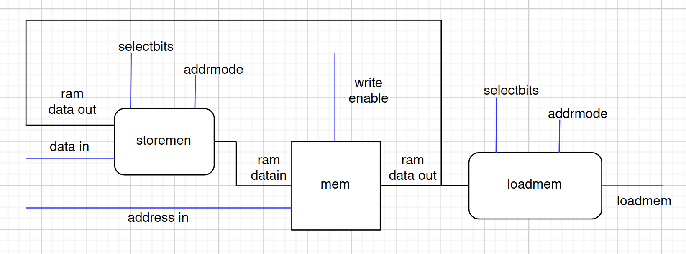

# iac-riscv-cw-30, README For memory
## Yi Zhang's  project log book of constructing memory
 

### 02/12/2022
Initialized the git repo with branches for each feature with our team.  

After a discussion of assigning tasks to each person, I am now responsible for data memory.  

Designed the instructions for all types of load and write with omar.  

Since we should not do bit manipulation inside the ram, I am going to make seperate module to do bit manipulation for loadmem and storemem. The design is shown as below.  

